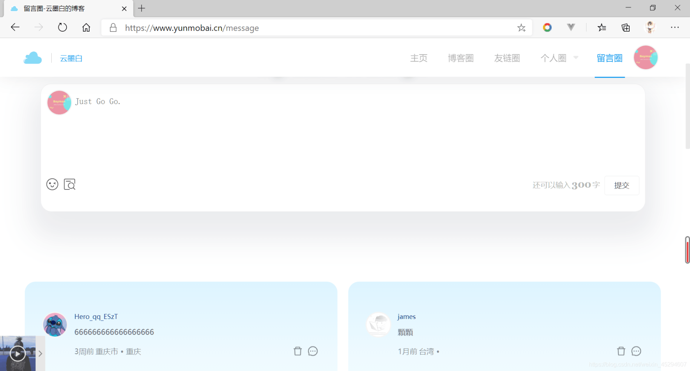
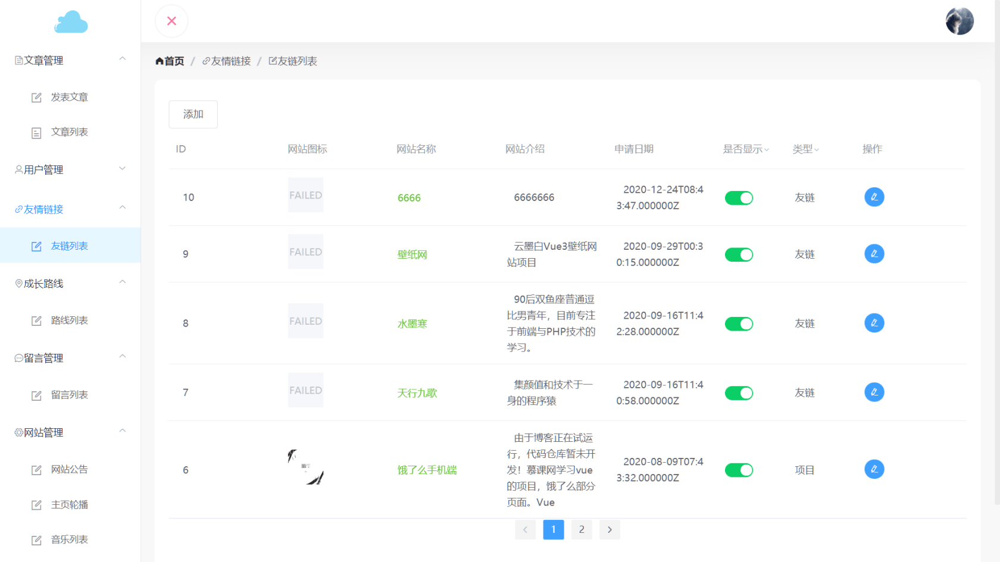

### Vue 3个人博客前端介绍
> 使用vite开发，更改多页面配置和架构，更新部分插件版本,修复图片加载失败，修复element-plus版本升级bug

本次去除Element UI，自己编写所需功能组件。编写了导航栏、全局提示、通知提醒框、空状态、无限滚动、按钮、头像、回到顶部、评论、音乐播放器、分页器、滑动条、Markdown预览、图片。其中图片样式来自Element,音乐播放器样式来自APlayer.其余的组件样式来自Ant Design of Vue。
也因为如此！本次前台打包后大小从1.3M降到0.9M左右。去除了注册，登录，用户信息功能！采用第三方登录！全站响应式布局，采用更简洁的设计！统一的设计风格，后台现在升级到Vue 3+Element Plus，添加数据统计。

### 项目演示
本次重构分为两个部分,(只重构前台，后台升级为Vue 3+Element Plus)

一：编写博客前台所需的功能组件

二：重新设计博客前台及功能

Vue3前端源码：[https://gitee.com/baymaxsjj/by-vue3-blog](https://gitee.com/baymaxsjj/by-vue3-blog)

Vue3UI组件源码：[https://gitee.com/baymaxsjj/by-vue3-ui](https://gitee.com/baymaxsjj/by-vue3-ui)

Vue2前端源码：[https://gitee.com/baymaxsjj/by-vue-blog](https://gitee.com/baymaxsjj/by-vue-blog)

<table>
  <tbody>
   <tr>
      <td align="center" valign="middle">
          
      </td>
      <td align="center" valign="middle">
          
      </td>
        <td align="center" valign="middle">
          
      </td>
    </tr>
    <tr>
      <td align="center" valign="middle">
          
      </td>
      <td align="center" valign="middle">
          
      </td>
        <td align="center" valign="middle">
          
      </td>
    </tr>
    <tr>
      <td align="center" valign="middle">
          
      </td>
      <td align="center" valign="middle">
          
      </td>
        <td align="center" valign="middle">
          
      </td>
    </tr>
  </tbody>
</table>


### 项目介绍

Vue版本：3.0.3，Laravel版本：7.0
1.Vue 多页面配置，一个项目包括前后端，

2.采用Element UI编写前后台

3.完成模块：

前台：首页介绍，文章展示，标签展示，分类展示，文章解析，生成目录，运行demo,模块显示，留言评论，友情链接，第三方登录（QQ,GITEE,GITHUB）,(登录，注册，找回密码，个人信息已移除)

后台：数据统计，发表文章（模块管理，多平台发布，提交百度收录），文章列表，用户管理，友情链接，项目管理，成长路线，留言管理，网站公告，首页轮播，音乐管理，

4.项目配置：前后台分开打包，按需加载，动态路由，gizp压缩，去除生产环境的console.log，反向代理，cdn引入，服务器自动拉取代码打包编译脚本

## 安装依赖

```
pnpm install
```

### 运行项目

```
//运行网站前台
pnpm run dev_home
//运行网站后台
pnpm run dev_admin
```

### 打包

```
//编译网站前台
pnpm run build_home
//编译网站后台
pnpm run build_admin
```

### vue cli配置参考

See [Configuration Reference](https://cli.vuejs.org/config/).

### 前后台分开打包

在package.json中配置

```json
 "scripts": {
        "dev_home": "vite --mode home_dev",
        "build_home": "vite build --mode home_pro",
        "preview_home": "vite preview --mode home_pro",
        "dev_admin": "vite --mode admin_dev",
        "build_admin": "vite build --mode admin_pro",
        "preview_admin": "vite preview --mode admin_pro"
    },
```

在vue.config.js配置

```js
const env=loadEnv(mode, process.cwd())
  const app_ip = env.VITE_API_HOST_IP;
  const isDev=mode=='development'
  const app_host = `http://${app_ip}`;
  let pageName = env.VITE_PAGE_NAME
  let pageRoot=env.VITE_PAGE_ROOT
  console.log('页面名称',pageName)
  console.log('页面人口',pageRoot)
```

### 多页面配置，
采用环境变量方式，进行多页面配置

```js
	 root:pageRoot,
    // 项目部署的基础路径
    build: {
      outDir: `./dist/${pageName}`,
      rollupOptions: {
        input: {
          main: resolve(__dirname, `${pageRoot}/index.html`),
        },
      },
    },
```


### 反向代理配置

由于项目使用到第三方的接口需要反向代理

```js
  devServer: {
        sockHost: "localhost",
        disableHostCheck: true,
        port: 8080, // 端口号
        host: "0.0.0.0",
        https: false, // https:{type:Boolean}
        open: true, //配置自动启动浏览器
        proxy: {
            //后台接口
            "/apis": {
                // target: "http://127.0.0.1:80/api/v1", // 需要请求的地址
                target: import.meta.env.VITE_APP_API_URL, // 需要请求的地址
                changeOrigin: true, // 是否跨域
                pathRewrite: {
                    "^/apis": "" // 替换target中的请求地址，也就是说，在请求的时候，url用'/proxy'代替'http://ip.taobao.com'
                }
            },
             //音乐接口
            "/music": {
                target: "https://music.liuzhijin.cn", // 需要请求的地址
                // target: import.meta.env.VUE_APP_URL,   // 需要请求的地址
                changeOrigin: true, // 是否跨域
                pathRewrite: {
                    "^/music": "" // 替换target中的请求地址，也就是说，在请求的时候，url用'/proxy'代替'http://ip.taobao.com'
                }
            },
             //每日英语接口
            "/english": {
                target: "http://sentence.iciba.com", // 需要请求的地址
                // target: import.meta.env.VUE_APP_URL,   // 需要请求的地址
                changeOrigin: true, // 是否跨域
                pathRewrite: {
                    "^/english": "" // 替换target中的请求地址，也就是说，在请求的时候，url用'/proxy'代替'http://ip.taobao.com'
                }
            },
            "/loimg": {
                target: "https://pc-store.lenovomm.cn/wallpapercontent/wallpaper/classify/tag_wallpapers", // 需要请求的地址
                // target: import.meta.env.VUE_APP_URL,   // 需要请求的地址
                changeOrigin: true, // 是否跨域
                pathRewrite: {
                    "^/loimg": "" // 替换target中的请求地址，也就是说，在请求的时候，url用'/proxy'代替'http://ip.taobao.com'
                }
            }
        }
    },
```


### nginx配置

```bash
location /apis {        
      proxy_pass 自己后端域名;
    }
    location /vendor/sitemap/styles/xml.xsl {        
      proxy_pass https://api.yunmobai.cn/vendor/sitemap/styles/xml.xsl;
    }
    location /music {
      proxy_pass https://music.liuzhijin.cn/;
    }
    location /english {
      proxy_pass http://sentence.iciba.com/;
    }
```


### 自动化脚本

```sh
echo 同步远程仓库
git pull
echo 编译主页
npm run build_home
echo 删除源文件
rm -r ../js ../css ../img ../fonts
echo 拷贝主页
cp -rf ../home/. ../
echo 删除编译文件
rm -r ../home ../admin.html
echo 完成
```